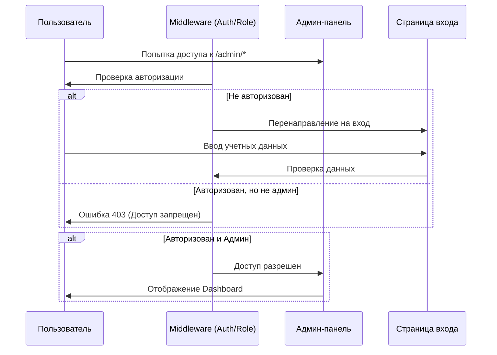
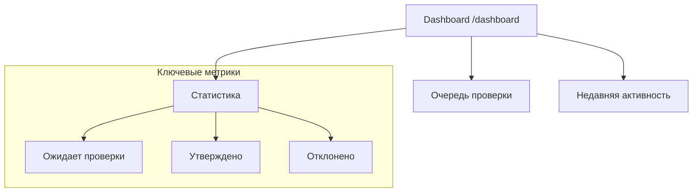
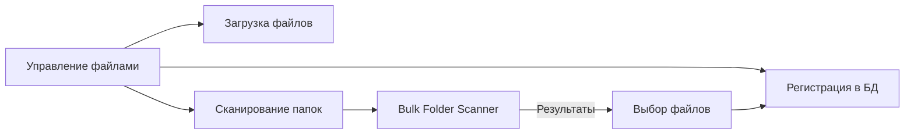
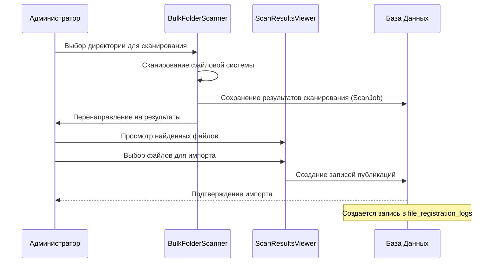
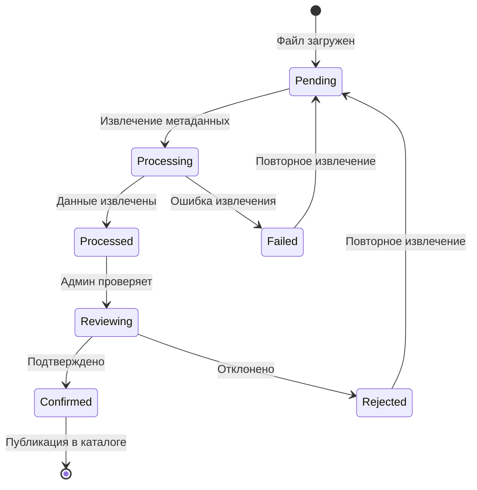

# Рабочие процессы администратора (Admin Workflows)

Этот документ описывает ключевые рабочие процессы администратора в системе Sifriot. Диаграммы и описания помогут понять, как функционируют различные части административной панели.

## 1. Аутентификация и Доступ (Authentication & Access)

Административный раздел защищен middleware `auth` и `role:admin`.



## 2. Обзор Панели Управления (Dashboard Overview)

**Маршрут:** `/dashboard`
**Компонент:** `App\Livewire\Admin\MetadataReviewDashboard`

Главная страница администратора предоставляет сводку по состоянию системы, в частности по очереди проверки метаданных.



## 3. Управление Файлами (File Management)

**Маршрут:** `/admin/files`
**Компонент:** `App\Livewire\Admin\FileManagement`

Централизованное управление файлами, включая загрузку, сканирование папок и регистрацию новых поступлений.



### 3.1 Сканирование и Регистрация (Scanning & Registration)

**Маршрут:** `/admin/bulk-scan` -> `/admin/scan-results/{id}`
**Компоненты:** `BulkFolderScanner`, `ScanResultsViewer`

Процесс массового добавления файлов из локальных директорий библиотеки.



## 4. Управление Фильтрацией (Filtration Management)

**Маршрут:** `/admin/filtration`
**Компонент:** `App\Livewire\Admin\FiltrationManagement`

Управление справочниками системы. Поддерживает CRUD операции для следующих сущностей:
- **Content Types** (Типы контента): Книги, Журналы, Статьи и т.д.
- **Genres** (Жанры): Фантастика, История и т.д.
- **Themes** (Темы): Тематические подборки.
- **Sections** (Разделы): Иерархическая структура каталога.
- **Authors** (Авторы)
- **Publishers** (Издатели)

```mermaid
classDiagram
    class FiltrationManagement {
        +activeTab: string
        +switchTab(tab)
        +create/edit/delete{Entity}()
    }
    class ContentType {
        +Name (EN/RU/HE)
        +Slug
        +Icon
    }
    class Section {
        +Name (EN/RU/HE)
        +ParentID
        +SortOrder
    }

    FiltrationManagement --> ContentType : Manage
    FiltrationManagement --> Section : Manage
```

## 5. Проверка Метаданных (Metadata Review)

**Компонент:** `MetadataReviewDashboard`, `MetadataReviewQueue`

Критический процесс проверки качества данных перед публикацией.

### Возможности фильтрации:
- **Статус метаданных:** Все, Ожидает, Обработано, Подтверждено, Отклонено, Ошибка.
- **Формат файла:** PDF, DJVU, DOC, FB2, EPUB.
- **Дата:** За 1/7/30 дней.
- **Атрибуты публикации:** По автору, жанру, разделу.

### Действия с записями:
- **Подтвердить (Confirm):** Данные корректны, публикация становится доступной.
- **Отклонить (Reject):** Данные неверны или дубликат.
- **Повторное извлечение (Re-extract):** Запуск извлечения метаданных заново (в том числе с AI).
- **AI Извлечение:** Использование Gemini для анализа текста (если настроено).



---
*Документ автоматически сгенерирован для проекта Sifriot.*
